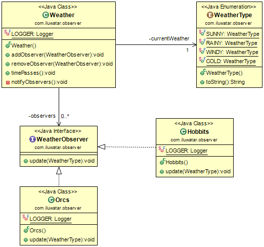
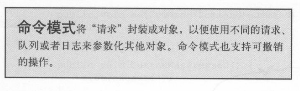

# design-patterns
[link](https://github.com/iluwatar/java-design-patterns)
## factory
head first设计模式在讲这个时候引入了很多的模式。从简单工厂一直往后。他的例子是根据pizza店来举例的。


[link](https://refactoringguru.cn/design-patterns/factory-comparison)

## abstact factory
GitHub里面举得例子是一个kindom的例子，兽人和精灵(war3玩家)。如果我想双方都要有自己的国家，那么首先找共同点，都有军队、国王和城堡。那么这么来说兽人和精灵都需要创建这几个东西，所以他factory定义的就是包含3个函数的interface，createXXX那3个东西。然后分别创建自己的东东。


菜鸟教程的举得是qq换装的例子，那里面的是颜色和形状。


感觉这个说的很号

这个感觉就很前面的不是那么像了。

那么如果一个抢红包的项目，红包该如何定义了。首先我们举几个很常见的红包模式。
均分红包、随机红包、个人红包、专属红包、画画红包等等。
他们的本质都有创建、分配数额、以及销毁。而不同的红包更是有不同的数据结构。所以红包本身也需要自己的定义。

我目前的设计如下,感觉设计还是很奇怪。
 

## visitor 
访问者模式适用于数据结构固定，而方法常修改的结构。
* visitor提供一个什么visit操作。
* concretevisit 实现visitor操作
* Element是一个基本元素，有一个accept操作，以visitor作为参数
* concreteelement实现accept操作
* objectstructe
    * 能够枚举element
    * 提供高层接口以访问元素
    * 是一个集合。


这个模式的耦合很离谱。
他在互相调用，所以数据结构需要很固定,他是有层次结构的。


```java
public class Commander extends Unit {

  public Commander(Unit... children) {
    super(children);
  }

  @Override
  public void accept(UnitVisitor visitor) {
    visitor.visitCommander(this);
    super.accept(visitor);
  }

  @Override
  public String toString() {
    return "commander";
  }
}

public class Sergeant extends Unit {

  public Sergeant(Unit... children) {
    super(children);
  }

  @Override
  public void accept(UnitVisitor visitor) {
    visitor.visitSergeant(this);
    super.accept(visitor);
  }

  @Override
  public String toString() {
    return "sergeant";
  }
}

public class Soldier extends Unit {

  public Soldier(Unit... children) {
    super(children);
  }

  @Override
  public void accept(UnitVisitor visitor) {
    visitor.visitSoldier(this);
    super.accept(visitor);
  }

  @Override
  public String toString() {
    return "soldier";
  }
}
```

```java
public class CommanderVisitor implements UnitVisitor {

  private static final Logger LOGGER = LoggerFactory.getLogger(CommanderVisitor.class);

  @Override
  public void visitSoldier(Soldier soldier) {
    // Do nothing
  }

  @Override
  public void visitSergeant(Sergeant sergeant) {
    // Do nothing
  }

  @Override
  public void visitCommander(Commander commander) {
    LOGGER.info("Good to see you {}", commander);
  }
}

public class SergeantVisitor implements UnitVisitor {

  private static final Logger LOGGER = LoggerFactory.getLogger(SergeantVisitor.class);

  @Override
  public void visitSoldier(Soldier soldier) {
    // Do nothing
  }

  @Override
  public void visitSergeant(Sergeant sergeant) {
    LOGGER.info("Hello {}", sergeant);
  }

  @Override
  public void visitCommander(Commander commander) {
    // Do nothing
  }
}

public class SoldierVisitor implements UnitVisitor {

  private static final Logger LOGGER = LoggerFactory.getLogger(SoldierVisitor.class);

  @Override
  public void visitSoldier(Soldier soldier) {
    LOGGER.info("Greetings {}", soldier);
  }

  @Override
  public void visitSergeant(Sergeant sergeant) {
    // Do nothing
  }

  @Override
  public void visitCommander(Commander commander) {
    // Do nothing
  }
}
```

可以看到他定义了visitor遇到了指挥官该怎么办，然后就是指挥官碰到了visitor该怎么办。他会和自己所有的下属进行打招呼。

## state
*代码在mystate内*
自动机，也是有限状态自动机


有限的状态和有限的输入输出。

其实这也是一种state模式，也就是状态模式，允许内部状态发生改变。


我们需要指定状态模式，比如这个例子里面所举得，我们设置了很多的状态，然后在规定状态转移的方式即可。

我们得首先画出自动机的一个关系图，然后根据这个关系图写代码。


然后就是在各个里面需要注册一个player来进行状态改变，然后在player里面设置所有的状态，和一个用于改变的状态即可。

```java
//state interface
public interface State {
    void attack();
    void quick();
    void beAttacked();
    void stop();
    void run();
}

```
```java 
//玩家类
public class player {
    State dieState;
    State dyingSate;
    State staticState;
    State runningState;
    State state;
    public player(){
        dieState=new dieState(this);
        dyingSate=new dyingState(this);
        staticState=new staticState(this);
        runningState=new runningState(this);
        state=staticState;
    }
    public void attack(){
        state.attack();
    }
    public void stop(){
        state.stop();
    }
    public void quit() {
        state.quick();
    }
    public void run() {
        state.run();
    }
    public void beAttacked() {
        state.beAttacked();
    }
    ...
    get...set...函数。
    ...
}
```
```java
//running demo 其他的类似定义就可以了。
public class runningState implements State{
    player man;

    public runningState(player man) {
        this.man = man;
    }
    public runningState(){};
    public void output(){
        System.out.println("running state");
    }
    @Override
    public void attack() {
        System.out.println("attack");
        output();
    }

    @Override
    public void quick() {
        System.out.println("进入dying状态");
        output();
        man.setState(man.getDyingSate());
    }

    @Override
    public void beAttacked() {
        System.out.println("闪避");
        output();
    }

    @Override
    public void stop() {
        System.out.println("停止奔跑进入static");
        output();
        man.setState(man.getStaticState());
    }

    @Override
    public void run() {
        System.out.println("已经在奔跑了");
        output();
    }
}
```
## Decorator

*Attach additional responsibilities to an object dynamically. Decorators provide a flexible alternative to subclassing for extending functionality.*

装饰器模式从名字来看就是多了些装饰作用，而不是直接改变功能。

首先GitHub那个例子是一个巨魔的例子(外国人均war3玩家)，他首先有一个小巨魔接口，里面是接口定义了巨魔应该最起初的作用，例如攻击他人，以及攻击力。然后实现这个接口用一个简单巨魔设置了初始的攻击力。这个时候引入装饰器，把简单的巨魔模板传入，作为基础，在这个基础上调用，并进行修改，本质上是功能的扩展，也就是装饰。


## builder
*Separate the construction of a complex object from its representation so that the same construction process can create different representations.*

高度自由的设置一些东西，如果选项都出来了，可以选择性的设置而且看起来很清晰。


## game-loop

*A game loop runs continuously during gameplay. Each turn of the loop, it processes user input without blocking, updates the game state, and renders the game. It tracks the passage of time to control the rate of gameplay.
This pattern decouples progression of game time from user input and processor speed*

这个设计模式好像是转为游戏存在，他的状态和普通的state不同，拿子弹的例子来收，他的控制器2个确认状态stop和running。但是他的子弹的状态不确定随着时间变化而变化，为了这种变化平缓稳定，就出现了这种模式，针对不同的变化种类衍生出不同的类继承gamectroller类进行控制重写。


## 单例
一个类只有一个能用的实例，基础实现在构造函数私有化，唯一对象静态，之后就涉及到线程安全的问题了。

```java 
//饥饿不安全
public class single {
    private single(){};
    private static single s;
    public single getinstance(){
        if(s==null)
            s=new single();
        return s;
    };
//    public  single getinstance(){return s;};
}

//饥饿安全
public class single {
    private single(){};
    private static single s;
    public  synchronized single getinstance(){
        if(s==null)
            s=new single();
        return s;
    };
//    public  single getinstance(){return s;};
}
//懒汉，线程安全
public class Singleton {
    private static Singleton instance = new Singleton();
    private Singleton (){}
    public static Singleton getInstance() {
        return instance;
    }
}
```

## observer

观察者模式，类似于发布订阅模式。可惜在里面找不到发布订阅这种，他可能没被认为是设计模式。
*Define a one-to-many dependency between objects so that when one object changes state, all its dependents are notified and updated automatically.*

GitHub的例子是生活着兽人和霍比特人，天气在变化，变化的时候就说话就会notify所有人。



## command



按照那个菜鸟教程股票的例子来看，股票有买和卖的情况，然后可以执行同一个execute，把他可以放入一个队列，这样就有撤销队列和恢复队列，但是主要的还是有一个类似于打工人的broker你把任务给他，都让他执行即可。

```java
//这是核心部分
public interface order {
    void execute();
}
```
```java
//stock
public class stock{
    private String name;
    private Integer num;
    private final Logger logger=LoggerFactory.getLogger(this.getClass());
    public void sold(int n){
        num-=n;
//        System.out.println("卖了"+String.valueOf(num));
        logger.info("卖了{},剩下{}",n,num);
    }
    public void buy(int n){
        num+=n;
        logger.info("买了{},剩下{}",n,num);
//        System.out.println("买了"+String.valueOf(num));
    }
```
```java
//这是对于stock的一种实现
public class buyStock  implements order{
    public stock getSt() {
        return st;
    }

    public void setSt(stock st) {
        this.st = st;
    }
    int num;
    public buyStock(stock st,int num) {
        this.st = st;
        this.num=num;
    }

    stock st;

    @Override
    public void execute() {
        st.buy(num);
    }
}
```
```java
//broke打工人
//要是想要就可以加上undo和redo队列。
public class Broker {
    private List<order> orderList=new ArrayList<>();

    public void takeOrder(order ... o ){
//        orderList.add(o);
        for(int i=0;i<o.length;i++){
            orderList.add(o[i]);
        }
    }
    public void placeOrders()
    {
        for(order o:orderList){
            o.execute();
        }
        orderList.clear();
    }
}
```
```java
//main
public class test {
    public static void main(String[] args) {
        stock s=new stock();
        s.setNum(10);
        Broker broker=new Broker();
        order b1=new buyStock(s,10);
        order b2=new buyStock(s,5);
        order s1=new soldStock(s,20);
        order b3=new buyStock(s,13);
        order s2=new soldStock(s,5);

        broker.takeOrder(b1);
        broker.takeOrder(b2);
        broker.takeOrder(s1);
        broker.takeOrder(b3);
        broker.takeOrder(s2);

        broker.placeOrders();
    }
}

```